# B 方向 工具调用型 Agent 系统


---

## 1. 项目概述

### 1.1 项目名称

`工具调用型 Agent 系统（Tool-Calling Agent）`

### 1.2 项目目标

本项目构建一个**可工具调用的智能 Agent 系统**，能够：

- 接收用户自然语言问题
- 自动判断是否需要调用工具（计算、读文件、搜索、格式转换等）
- 调用相应工具获取结果，基于结果生成最终回答
- 支持多轮对话、记忆管理、历史压缩
- 提供 Web 交互界面，支持多模型切换和批量任务

### 1.3 当前完成情况

| 类型 | 完成情况 |
|---|---|
| 基础要求 | ✅ 完整 Agent 循环（LLM 推理 → 工具执行 → 最终回答）、7 种工具、记忆检索与保存、Web 对话界面 |
| 进阶要求 | ✅ 规划-执行模式（用户确认卡片）、对话中实时切换模型、Token 统计、历史压缩摘要、KV 混合记忆检索 |
| 支持的主要任务类型 | 数学计算、文件读取、文档搜索、表格分析、格式转换、代码执行、批量任务 |
| 当前限制 | 批量任务仅串行；DeepSeek API 模式不支持本地工具的某些高级特性 |

---

## 2. 整体流程与模块结构

### 2.1 模块边界

| 模块 / 阶段 | 入口文件 / 入口函数 | 主要职责 | 输入 | 输出 |
|---|---|---|---|---|
| B1 Runtime | `code/b1_agent_runtime.py:run_single_turn` | 协调 B3/B4/B5 完成单轮 Agent 循环 | 用户消息 + 配置 | 最终回答 + 工具调用过程 |
| B1 Web API | `agent_api.py:post_message` | FastAPI 异步 HTTP 接口 + polling 流式 | HTTP JSON | SSE 事件流 |
| B1 Web 前端 | `agent_chat.html` | 对话界面 + 模型切换 + 批量任务面板 | 用户交互 | 渲染结果 |
| B3 工具层 | `code/b3_tool_layer.py:execute_tool_calls` | 执行 7 种工具（计算、读文件、搜索、格式转换等）| tool_calls 列表 | 工具结果 |
| B4 LLM 推理 | `code/b4_local_agent_llm.py:generate_ai_message` | 调用本地 Qwen 或 DeepSeek API 生成响应 | messages + tools_schema | ai_message (含 tool_calls) |
| B5 记忆系统 | `code/b5_memory.py:load_memory / save_memory` | 记忆文档的加载、检索、保存、CRUD | query / memory_id | 记忆文档 / 更新状态 |

### 2.2 系统架构图或流程图

1. **系统架构**  
   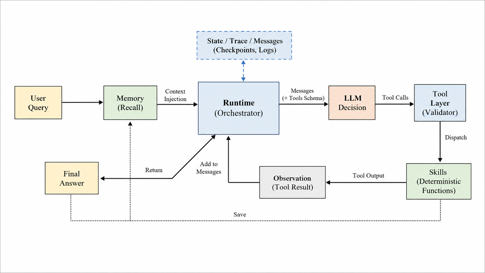


### 2.3 一次完整任务或实验的流程

1. **原始输入**：用户在浏览器输入问题（如"计算 (100+200)*3"）或提交批量任务 JSON 文件
2. **记忆检索**：B1 调用 B5 检索相关记忆，注入 system prompt
3. **LLM 决策**：B4 的模型（Qwen 或 DeepSeek）判断是否需要调用工具
4. **工具执行**：如需工具，B3 执行对应 Python 函数（如 calculator），结果回传
5. **再次推理**：模型看到工具结果后生成最终回答
6. **前端渲染**：流式事件（polling）驱动 UI 展示思考过程 + 工具调用 + 最终回答
7. **后处理**：累积 Token 统计、对话持久化到磁盘、可选记忆存档
8. **批量任务**：多个问题独立执行，逐条返回结果并写 `outputs/batch/`

---

## 3. 模型、数据集与外部资源

### 3.1 模型说明

| 项目 | 内容 |
|---|---|
| 使用模型 | Qwen3.5-4B（本地）/ DeepSeek V4 Flash / DeepSeek V4 Pro（API）|
| 模型来源 | Qwen 本地已有；DeepSeek 通过 OpenAI 兼容 API |
| 项目内相对路径 | Qwen: `/home/czc/agent/Qwen3.5-4B`；DeepSeek: `configs/model.yaml` 配置 |
| 是否需要 GPU | Qwen 需要；DeepSeek API 不需要 |
| 是否需要联网运行 | DeepSeek 需要联网；Qwen 纯本地 |

```bash
# DeepSeek 无需下载，只需在 configs/model.yaml 中配置 api_key
# Qwen 本地模型需提前准备到路径
```

### 3.2 数据集 / 示例数据说明

| 数据或文件 | 用途 | 来源 | 项目内相对路径 |
|---|---|---|---|
| batch_input.json | 批量任务示例（3 个独立问题）| 项目自带 | `data/batchTask/` |
| agent_intro.txt | 工具调用测试文档 | 项目自带 | `data/docs/` |
| tool_calling.md | 工具使用说明 | 项目自带 | `data/docs/` |
| results.csv | 表格分析测试数据 | 项目自带 | `data/tables/` |

---

## 4. 环境安装

### 4.1 运行环境

| 项目 | 要求 |
|---|---|
| Python 版本 | 3.10+ |
| 操作系统 / 服务器环境 | Linux |
| GPU 要求 | Qwen 本地模式需要；DeepSeek API 模式不需要 |
| 主要依赖 | fastapi, uvicorn, pydantic, pyyaml, openai, transformers, torch |

### 4.2 安装步骤

```bash
# 克隆项目
git clone <repo_url> && cd agent

# 创建虚拟环境
python -m venv venv && source venv/bin/activate

# 安装依赖
pip install fastapi uvicorn pydantic pyyaml openai transformers torch

# 启动 Web 服务
python agent_api.py
# 浏览器访问 http://localhost:8000
```

常见环境问题：

- **模型路径不存在**：确认 `configs/model.yaml` 中 `model_name_or_path` 指向正确位置
- **DeepSeek API 400 错误**：检查 `api_key` 配置和消息格式（空 tool_calls 已在前端清洗）

---

## 5. 输入文件与配置文件说明

### 5.1 主要配置文件

| 配置文件 | 作用 | 需要修改的字段 |
|---|---|---|
| `configs/model.yaml` | 模型配置（本地 Qwen + DeepSeek API），包含 `models:` 多模型段 | `api_key`（DeepSeek）、`api_base`、`model_name_or_path`（Qwen）|
| `configs/tools.yaml` | 7 种工具定义（模块路径、函数名、参数 Schema、返回值）| 新增工具需在 `tools:` 下添加 + 在 `toolsets.basic_tools` 列表注册 |
| `configs/memory.yaml` | 记忆系统配置（根目录、索引路径、全局/对话记忆子目录、向量维度）| `root_dir`（记忆存储路径）、`max_memory_chars`（截断长度）|

**model.yaml 多模型配置示例：**

```yaml
models:
  qwen3.5-4b:
    backend: transformers
    model_name_or_path: /home/czc/agent/Qwen3.5-4B
    torch_dtype: bfloat16
    device_map: auto

  deepseek-v4-flash:
    backend: openai
    api_base: https://api.deepseek.com/v1
    api_key: sk-xxx
    model: deepseek-v4-flash
```

**tools.yaml 工具定义示例：**

```yaml
toolsets:
  basic_tools:             # 工具集名称（B1 --toolset 参数引用）
    - calculator
    - file_reader
    - local_file_search

tools:                     # 每个工具的具体定义
  calculator:
    module: skills.calculator      # Python 模块路径
    function: calculator            # 函数名
    description: Calculate a safe arithmetic expression.
    parameters:
      expression:
        type: string
        description: Arithmetic expression
    required: [expression]
    returns:
      result:
        type: number
        description: Calculated value.
```

**memory.yaml 示例：**

```yaml
memory:
  root_dir: ../memory             # 记忆根目录（相对 B5 执行路径）
  global_memory_dir: global       # 全局记忆子目录
  conversation_memory_dir: conversations  # 对话记忆子目录
  index_path: memory_index.json   # 索引文件路径
  max_memory_chars: 2000          # 单条记忆最大字符数
```

### 5.2 主要输入文件

| 输入文件 | 用途 | 适用场景 |
|---|---|---|
| `data/batchTask/batch_input.json` | 3 个独立问题（计算 + 读文件 + 搜索）| 批量任务演示 |
| `data/docs/agent_intro.txt` | file_reader / local_file_search 测试文档 | B2/B3 工具调用演示 |
| `data/docs/tool_calling.md` | 工具使用说明文档 | read_and_convert 演示 |
| `data/tables/results.csv` | CSV 表格数据 | table_analyzer 演示 |
| `cli_io/baseline_input.json` | B1 CLI 单轮 baseline 输入 | B1 基础演示 |
| `cli_io/repl_input.json` | B1 CLI 多项交互输入 | B1 进阶 REPL 演示 |
| `cli_io/batch_input.json` | B1 CLI 批量任务输入 | B1 进阶批量演示 |

### 5.3 模块说明文件（B2-B5 个人演示）

每个模块（B2/B3/B4/B5）有独立的输入文件：

| 模块 | 演示用输入文件路径 | 说明 |
|---|---|---|
| B2 Skill | `data/tool_inputs/tool_input_calculator.json` | 单独测试每个 Skill 函数 |
| B3 Tool Layer | `data/messages/ai_message_with_tool_calls.json` | 单独测试 tools_schema 生成和 tool_calls 执行 |
| B4 LLM | `data/messages/messages_no_tool.json`、`tools_schema_basic.json` | 单独测试 LLM 推理和 AIMessage 生成 |
| B5 Memory | `data/memory_inputs/memory_save_input.json` | 单独测试记忆查找与保存 |

---

## 6. 完整流程 Demo 运行

### 6.1 Demo 样例说明

| Demo | 输入文件 / 输入内容 | 演示目的 |
|---|---|---|
| Demo 1: Web 对话（计算器）| 用户输入 "计算 (100 + 200) * 3" | 验证完整 Agent 循环 + 工具调用 + 流式输出 |
| Demo 2: 规划模式 | 选"规划模式"，发"计算 123+456 并搜索 README" | 验证用户确认卡片 + 多工具计划执行 |
| Demo 3: 批量任务 | 上传/选择 batch_input.json | 验证多任务串行执行 + 逐条结果返回 |
| Demo 4: 记忆检索 | 在记忆面板输入关键词搜索 | 验证 KV 混合检索 + 前端展示 kw/vec 分数 |
| Demo 5: 格式转换 | 发"读取 tool_calling.md 并转为 JSON" | 验证 read_and_convert 工具 + 输出保存 |

### 6.2 运行命令

```bash
# 启动服务
cd agent && python agent_api.py

# Demo 1 & 2: 浏览器 http://localhost → 直接发消息
# Demo 3: 点击顶部 📋 按钮 → 选择 batch_input.json → 开始执行
# Demo 4: 点击左侧齿轮 → 记忆面板 → 输入关键词搜索
# Demo 5: 浏览器发 "读取 data/docs/tool_calling.md 并转为 markdown"
```

### 6.3 关键参数说明

| 参数 | 说明 |
|---|---|
| model | 可选 qwen3.5-4b / deepseek-v4-flash / deepseek-v4-pro |
| mode | prompt_json（默认）/ plan_execute（规划模式）/ mock（调试）|
| max_turns | 最大工具调用轮次，默认 3 |

### 6.4 运行成功的判断方式

- 终端显示 `Uvicorn running on http://localhost:8000` 无报错
- 浏览器输入问题后，左侧气泡依次显示"思考中" → 工具调用 → 最终回答
- Token 统计栏实时更新
- 批量任务执行后逐条显示 ✓（成功）或 ✗（失败）

---

## 7. 输出文件与结果说明

### 7.1 主要输出文件

| 输出文件 | 生成模块 / 阶段 | 格式 | 说明 |
|---|---|---|---|
| `outputs/web_sessions/{sid}/session.json` | Web API | JSON | 对话历史 + Token 统计持久化 |
| `outputs/batch/batch_{ts}.json` | 批量任务 | JSON | 每个任务的 status + final_answer |
| `outputs/format_converter_files/converted.*` | format_converter | MD/JSON | 格式转换后的文件 |
| `outputs/read_and_convert/converted.*` | read_and_convert | MD/JSON | 读取并转换后的文件 |
| `cli_io/results/baseline/messages.json` | B1 CLI baseline | JSON | 完整消息序列 |
| `cli_io/results/baseline/trace.json` | B1 CLI baseline | JSON | 运行 trace（每轮 tool_calls + latency）|
| `cli_io/results/baseline/final_answer.md` | B1 CLI baseline | Markdown | Agent 最终回答 |
| `cli_io/results/batch/batch_summary.jsonl` | B1 CLI 批量 | JSONL | 每个任务的执行记录 |

### 7.2 运行截图或结果图例

**系统整体运行截图：**

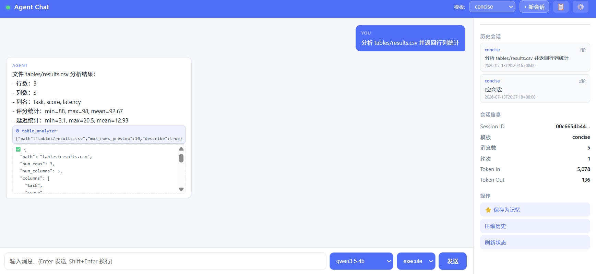

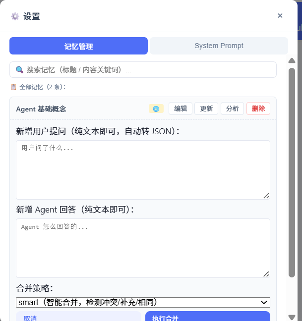

**不同功能运行截图：**

| 多轮对话（流式 polling 输出）| 模型切换（Qwen ↔ DeepSeek）|
|---|---|
| 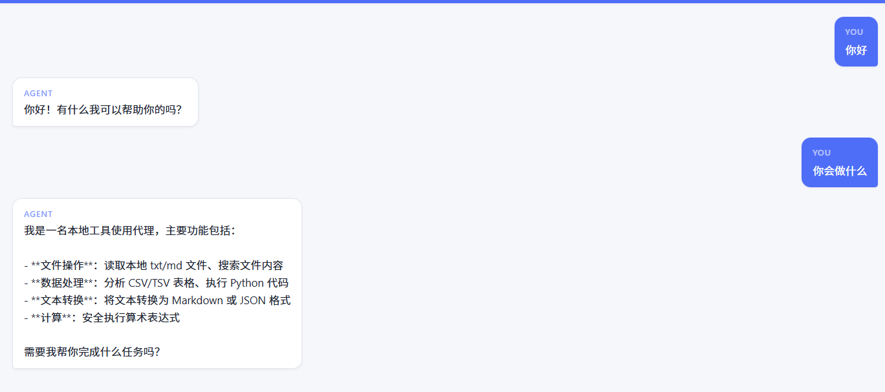 |  |

| Token 统计 + 记忆检索 | 规划-执行模式（用户确认卡片）|
|---|---|
| 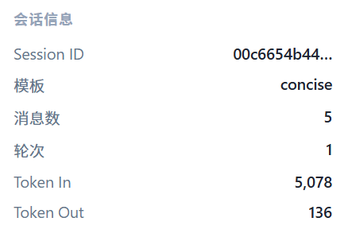 | 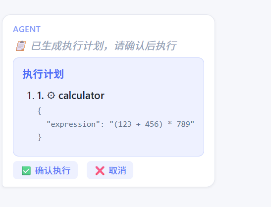 |

| 历史压缩（摘要替换旧消息）| 模板切换（tool_master ↔ teacher）|
|---|---|
|  | 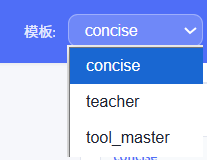 |

**各模块架构图：**

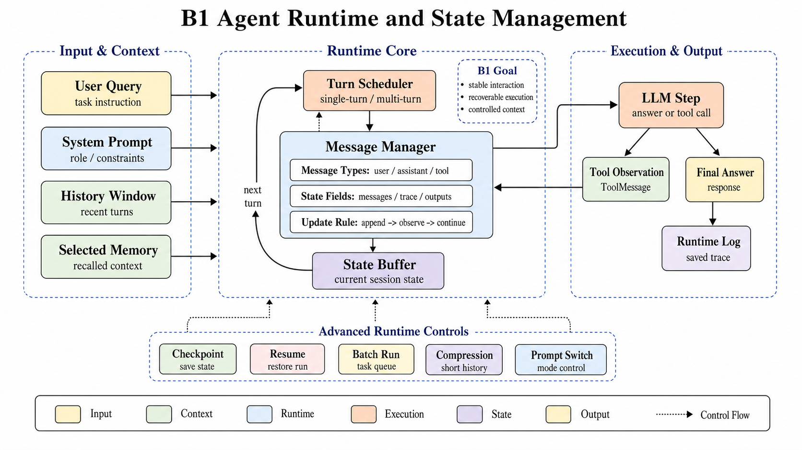

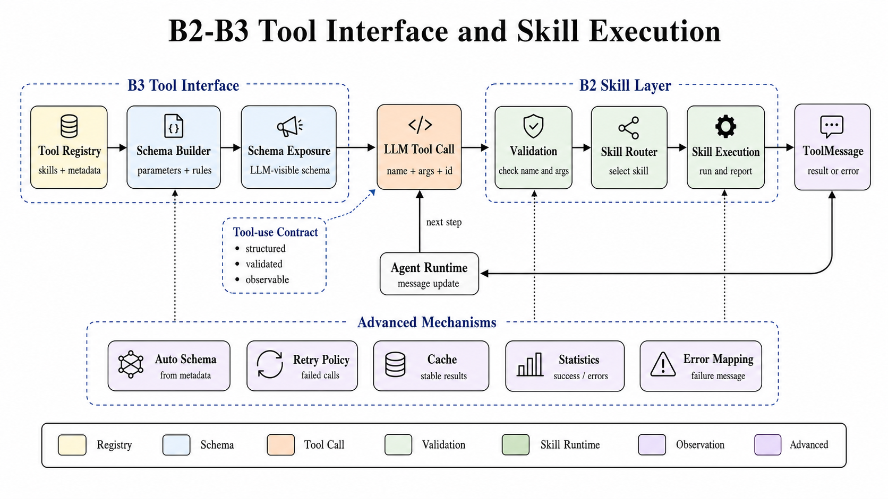

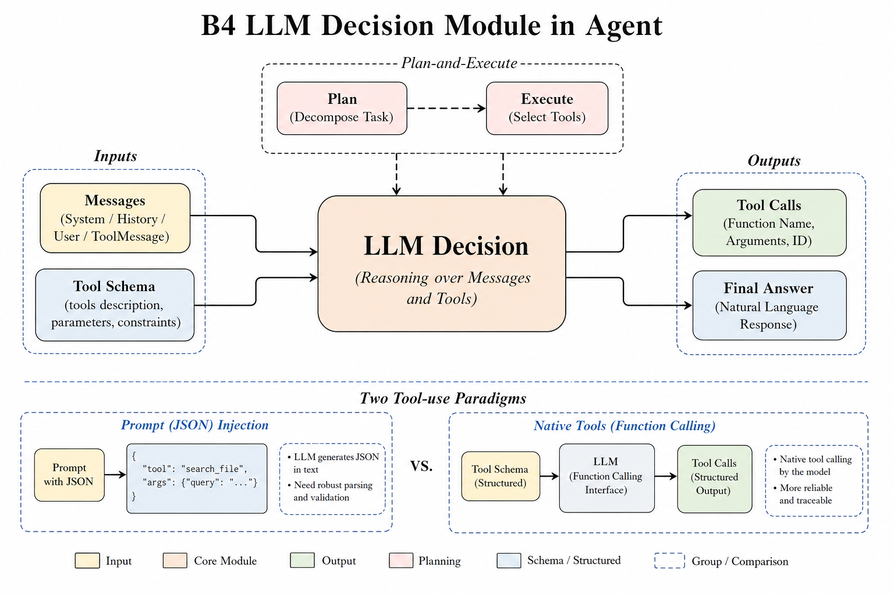

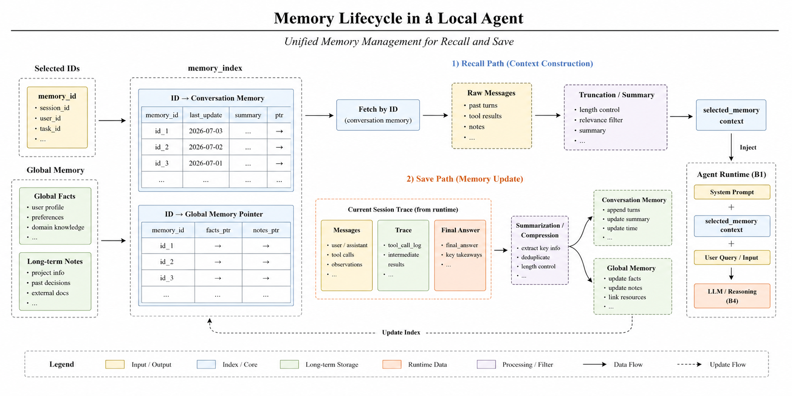


---

## 8. 协作实现说明

### 8.1 模块输入输出格式约定

| 调用链 | 数据格式 | 关键约定 |
|---|---|---|
| B1 → B5 (load_memory) | 输入：`selected_memory_ids`, `use_global_memory`；输出：`{selected_memory_docs, total_chars}` | 返回的记忆以 `<memory id="..." type="...">` 标签包裹，B1 拼入 system prompt |
| B1 → B3 (get_tools_schema) | 输入：`toolset` 名称；输出：`[{type:"function", function:{name, description, parameters}}]` | OpenAI function-calling 格式，直接传给 B4 |
| B1 → B4 (generate_ai_message) | 输入：`messages`, `tools_schema`；输出：`{ai_message, status, token_stats}` | B4 输出有 tool_calls 时 B1 交给 B3 执行 |
| B1 → B3 (execute_tool_calls) | 输入：`tool_calls` 列表；输出：`tool_messages` 列表 | 工具结果标准化为 `{role:"tool", tool_call_id, name, content}` |
| B4 → B2 (Skill 调用) | 通过 B3 间接调用；输入：函数 args；输出：JSON 序列化结果 | 每个 Skill 返回 dict，B3 包装为 ToolMessage |
| B1 → B5 (save_memory) | 输入：`conversation_id`, `save_type`, messages/trace/answer 路径；输出：`memory_id` | 生成 `.md` 文件存储在 `memory/` 目录 |

### 8.2 降低联调成本的配置

- **统一 tools.yaml**：B2 每新增一个 Skill 函数，只需在 `tools.yaml` 加一项定义 + 在 `toolsets.basic_tools` 注册，B3 自动加载生成 schema
- **统一 model.yaml**：B4 支持多模型配置，B1 透传 `model_name` 即可切换，无需改代码
- **共享 configs/ 目录**：所有配置文件集中管理，B1 启动时指定 `--model_config`/`--tools_config`/`--memory_config`

### 8.3 数据格式不一致处理

| 问题 | 解决方案 |
|---|---|
| B4 返回格式不统一（DeepSeek vs Qwen）| B1 中 `_step_generate_ai_message` 统一返回 `{ai_message, status, token_stats}` 结构 |
| B3 tool_calls 参数缺字段 | `normalize_tool_call` 自动补全 `id`、`type`、`function` 结构 |
| OpenAI API 不接受空 `tool_calls: []` | B4 的 `_openai_generate` 中清洗消息（移除空 tool_calls，tool 消息只保留 role/tool_call_id/content）|
| B4 输出含 markdown 代码块包裹的 JSON | `_parse_model_output` 多级解析：JSON → markdown 代码块 → JSON 片段 |

### 8.4 Git 协作与分支管理

- 每个模块（B1/B2/B3/B4/B5）一个开发分支，完成后合入 main
- 通过 Issue 跟踪 Todo（如"DeepSeek API 模式修复"、"批量任务并行化"）
- 配置文件（model.yaml 的 api_key）不提交到 Git，使用 `.gitignore` 或本地覆盖

### 8.5 多模块配合场景

| 场景 | 参与模块 | 配合方式 |
|---|---|---|
| 标准对话 | B1 + B4 | B1 调 B4 获得最终回答 |
| 工具调用对话 | B1 + B3 + B4 + B2 | B1 调 B4 获得 tool_calls → B3 调 B2 执行 → 结果回传 B1 → 再次调 B4 |
| 规划模式 | B1 + B4 + 前端 | B1 暂停等用户确认 → POST /confirm-plan → 唤醒继续 |
| 记忆检索 | B1 + B5 | B1 每轮前调 B5 检索相关记忆注入 system |
| 记忆保存 | B1 + B5 | 对话成功后 B1 调 B5 存档为 `.md` 文档 |
| 批量任务 | B1 + B3 + B4 + 前端 | 前端提交 → 后台遍历执行 → polling 返回结果 |

---

## 9. 已知问题与改进方向

| 问题 | 当前原因 | 可能改进 |
|---|---|---|
| 批量任务只能串行 | 当前为 for 循环 | 可改为线程池并行执行多个任务 |
| DeepSeek 不支持部分本地工具特性 | API 模式与本地模式行为差异 | 增加 API 模式的工具格式适配层 |
| 记忆向量索引首次加载慢 | 需遍历所有文档计算向量 | 后台预热（已实现 _warm_memory_vectors）|
