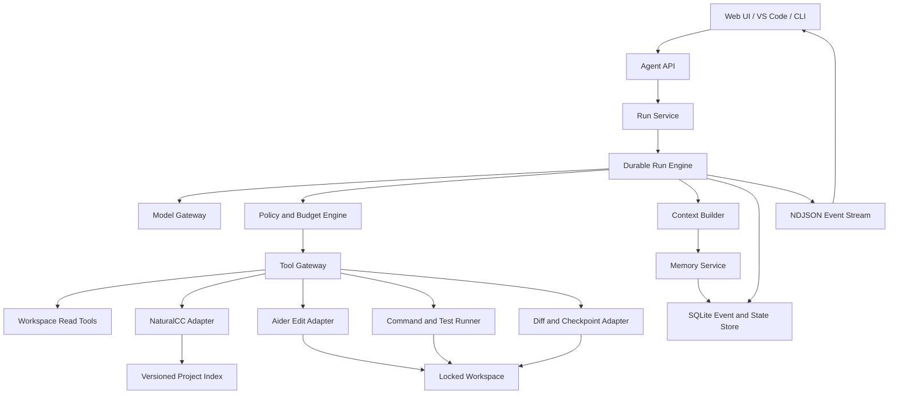

# code_agent 自主 Coding Agent 改造评估与执行方案

> 状态：待评审设计稿  
> 日期：2026-07-28  
> 评估对象：`code_agent/`、`NEUAgent/`、`code_agent/改造可行性分析与执行Prompt.md`

## 1. 结论

原方案的方向是正确的，但不能按现有 6 个 Phase 和示例代码直接实施。

- “LLM 直调 + Aider 降级为编辑工具”是正确的主方向。
- Tool Definition、多轮会话、持久化、记忆检索和上下文压缩都是必要能力。
- 现有方案更接近“带工具调用的聊天 Demo”，还不是可长期运行、可恢复、可审计、能安全修改真实仓库的 Coding Agent。
- 最大缺口不是 Prompt，而是持久化运行状态、工具安全策略、验证闭环、并发与恢复语义、记忆治理，以及确定性测试。
- 推荐保留旧 `/api/run`，新增一套独立的 Agent Runtime，通过适配器复用 NaturalCC、Aider 和现有插件；不要把 UI Feature Plugin 直接等同于模型 Tool。

综合判断：

| 维度 | 评分 | 判断 |
|---|---:|---|
| 改造方向 | 8/10 | 目标与主要组件选择合理 |
| 当前示例代码可执行性 | 4/10 | 存在接口不匹配、状态丢失和安全问题 |
| 自主决策闭环 | 5/10 | 有推理循环，但缺任务状态机、重规划和验证 |
| 长期记忆设计 | 4/10 | 有存取和检索雏形，缺治理、来源和失效机制 |
| 编程能力 | 4/10 | 能委托 Aider 编辑，但缺通用读写、命令、测试和 diff 闭环 |
| 安全与可审计性 | 2/10 | 路径、执行、审批、日志脱敏和并发控制不足 |
| 测试与验收 | 3/10 | 验收依赖模型临场行为，缺确定性回归测试 |

最终建议：**有条件通过，但必须按本文方案重排实施顺序并重做运行时边界。**

## 2. 本方案的默认边界

为避免“自主”被误解为无限权限，首个可用版本采用以下默认值：

1. 单机、本地、单用户运行。
2. Agent 只能在用户选定的 workspace 内读写。
3. 读操作可自动执行；写文件、运行命令、调用 Aider、联网和 Git 写操作进入策略判断。
4. 默认不自动提交、不推送、不安装依赖、不访问 workspace 外文件。
5. 每个 workspace 同时只允许一个写入型 Run；只读 Run 可以并发。
6. 旧 `/api/run` 行为保持不变，新能力通过 `/api/agent/*` 提供。
7. 第一阶段只支持当前 NaturalCC 已有的 C/C++、Java 语义增强；其他语言仍可使用通用文件和命令工具，但不宣称有同等语义分析能力。
8. 长期记忆默认按 project 隔离，不把一次对话的完整内容自动提升为全局记忆。

这些边界不是永久限制，而是首个安全、可验证版本的产品契约。

## 3. 当前代码基线

### 3.1 可复用资产

`code_agent` 已具备以下可复用能力：

- FastAPI + NDJSON 流式接口和 React Web UI。
- Feature Plugin 注册、表单 Schema 和 AIDER/DIRECT/HYBRID 调度。
- NaturalCC 的 C/C++、Java 项目解析和语义 Prompt。
- Aider 子进程构造、执行和输出收集。
- 代码补全、总结、修复、漏洞扫描、设计稿转代码和知识图谱插件。
- API Key 掩码、模型选择和 workspace 扫描基础能力。

`NEUAgent` 可作为参考的部分：

- Tool Schema 和参数校验。
- Tool message 标准化。
- 多轮 Tool Calling 循环。
- checkpoint、批处理、上下文摘要和记忆 CRUD 的思路。
- 文件工具的数据根目录约束。

### 3.2 不能直接继承的限制

- 当前 Feature Plugin 合同面向 UI 功能，不包含工具风险等级、幂等性、超时、输出上限、审批需求和可并行性。
- 当前 `/api/run` 在异步请求内迭代同步生成器，Aider/NaturalCC 重任务会占用事件循环。
- 当前 Aider 输出生成器每次返回“从开始到当前的累计日志”，若 Agent 再把每次结果 `join`，会形成重复内容和近似二次增长。
- 当前 Aider 参数包含 `--yes-always`，只有在外层策略已经批准且 workspace 已锁定时才适合作为底层实现。
- `sanitize_target_files()` 只做格式清洗，没有证明最终路径位于 workspace 内。
- 当前项目没有正式单元测试基础设施；本环境可完成 Python 静态编译，但没有可直接调用的 `pytest`。
- 当前 workspace 根目录没有 Git 元数据。后续不能默认依赖 Git checkpoint，必须先检测版本库；无 Git 时使用补丁/文件快照。

## 4. 对原 6 个改造点的逐项评估

### 4.1 Agent Loop

判断：**方向合理，核心实现需要升级为持久化状态机。**

原方案的 `while tool_calls` 能完成最小闭环，但缺少：

- `queued/running/waiting_approval/paused/completed/failed/cancelled` 等持久状态；
- 进程重启后的恢复点；
- 每一步的唯一 ID、幂等键和重放语义；
- 失败分类、重试上限、重新规划和降级回答；
- 写入前审批、workspace 锁、取消和超时；
- 编辑后的 diff、测试和回归判断；
- LLM 次数、Tool 次数、时间、Token 和费用的联合预算。

结论：循环应成为 `RunEngine.step()` 的一部分，而不是整个系统的状态载体。

### 4.2 Skill 统一注册

判断：**统一 Tool Contract 是必要的，但“复制 NEUAgent Skills + 包装现有 Plugin”不是可靠边界。**

主要问题：

1. 原方案宣称“6 个插件 + 7 个 Skill + 2 个 NaturalCC 能力”，示例却注册了 5 个插件、7 个 NEUAgent Skill 和 3 个 NaturalCC/Aider Tool，总数恰好仍为 15；`design_to_code` 被遗漏，计数掩盖了能力缺失。
2. `SkillRegistry.execute()` 没有严格参数验证、未知参数拒绝、超时、取消、输出截断和结构化错误。
3. `project_dir`、API Key 等可信运行上下文不应由模型在 Tool 参数中提供；模型只能给相对路径或业务参数。
4. Plugin 生成器可能返回字符串、字典或 `PluginResult`，示例包装器不能正确保留全部结果语义。
5. 直接复制 NEUAgent 文件会制造两份来源，后续修复难以同步；应抽取小型共享合同或为确实需要的能力重写适配器。

结论：建立独立 `ToolSpec`/`ToolResult`，Plugin 仅通过显式 Adapter 接入。

### 4.3 模型自主决策

判断：**Tool Calling 是必要机制，但 Prompt 不是自主性的主体。**

需要补齐：

- 统一 Model Gateway，隔离 DeepSeek/OpenRouter/OpenAI 兼容差异；
- 原生 Tool Calling 与 JSON fallback 的明确降级路径；
- Tool Call 参数验证失败后的可恢复反馈；
- 计划、执行、观察、验证和重新规划的阶段协议；
- 强制策略层，而不是让模型自己决定是否有权限；
- Tool 输出的大小、可信级别和 prompt-injection 标记；
- 小模型和大模型的契约测试。

结论：模型负责提出动作，策略层负责授权，Tool Gateway 负责执行，验证器负责判断结果。

### 4.4 多轮对话和 Session

判断：**可行，但原示例存在状态丢失和路径风险。**

原示例中：

- endpoint 先向 `session.messages` 加入用户消息；
- `run_agent_loop()` 随后执行 `messages = list(session_messages)`；
- assistant/tool 消息只写入副本；
- 最后的 `session.save()` 因此只会保存用户消息。

此外，用户传入的 `session_id` 被直接拼到目录路径，加载和递归删除均没有 ID 格式校验或根目录约束；并发保存也没有原子写、版本号或文件锁。

结论：区分 `Thread`、`Run`、`Step`，用 SQLite 事务和 append-only 事件记录作为首个可靠实现。

### 4.5 长期记忆

判断：**需要重构概念，再实现存储。**

原方案把“Session 历史”“上下文摘要”“长期记忆”混在一起。它们应该分别是：

- Working State：当前 Run 的计划、步骤、工具结果、diff 和测试状态；
- Episodic Memory：已完成任务的目标、关键决策、结果和失败经验；
- Semantic/Preference Memory：稳定的项目事实、用户偏好和工程约束；
- Project Knowledge：由源码和 NaturalCC 生成、可按文件版本失效的索引。

NEUAgent 所称的“纯 Python TF-IDF 向量”实际是哈希词频向量，没有语料级 IDF；中文按单字切分，容易产生碰撞和低质量召回。可用于实验，不能作为首版长期记忆的质量承诺。

首版应采用 SQLite + FTS5/BM25 + 结构化元数据；真实 embedding 作为后续可选增强，并通过离线检索集验证后再启用。

### 4.6 上下文压缩

判断：**必要，但不能按固定“保留最后 K 条消息”切割。**

工具协议要求 assistant tool-call 与对应 tool result 成组保留。按消息数量切割可能产生孤立 tool 消息或丢掉未完成步骤。压缩还必须保留：

- 用户原始目标与硬约束；
- 当前计划和未完成步骤；
- 已修改文件和当前 diff 摘要；
- 最近测试命令、退出码和失败信息；
- 已批准/拒绝的动作；
- 记忆引用及来源，而不是把记忆文本混入不可追踪摘要。

触发条件应以模型上下文预算为主，消息数量只作为辅助信号。

## 5. 三种可选路线

### 路线 A：最小修补原方案

做法：保留 6 Phase，仅修正函数签名、Session 保存和路径校验。

优点：

- 最快得到可演示的工具调用界面；
- 对现有源码改动较少。

缺点：

- 运行状态仍主要存在内存和消息列表中；
- 失败恢复、审批、并发、记忆污染和验证闭环仍然薄弱；
- 后续会再次重构。

适用：课堂演示或一次性原型。  
不推荐作为“真正的自主 Coding Agent”目标。

### 路线 B：渐进式持久化 Agent Runtime

做法：保留旧功能，新建独立 Runtime；先只读自治，再开放受控写入，最后加入长期记忆和高级自治。

优点：

- 兼容现有 UI、NaturalCC、Aider 和插件；
- 每阶段都有可工作的产品增量和回退路径；
- 安全、恢复、测试和可观测性可以成为底层契约；
- 后续可替换 Aider、模型或记忆后端。

缺点：

- 初期文件和数据模型设计工作多于路线 A；
- 需要先补测试基础设施。

**推荐路线。**

### 路线 C：迁移到成熟 Agent Framework

做法：引入现成的图/状态机框架，由框架承担 checkpoint、分支和恢复。

优点：

- 可能更快获得图执行、持久化和可视化能力；
- 社区生态丰富。

缺点：

- 引入较重依赖和框架语义；
- NaturalCC、Aider、现有 Plugin 和流式 UI 仍需适配；
- 版本演进和供应商锁定风险高；
- 不能自动解决工具安全、记忆质量和验证问题。

适用：团队已确定长期维护该框架。  
本项目现阶段不推荐。

## 6. 推荐目标架构



### 6.1 核心原则

1. **模型不直接执行任何动作。** 模型只产生候选 Tool Call。
2. **可信上下文不进入模型参数。** workspace、密钥、权限和输出目录由服务端注入。
3. **事件先落盘，再执行副作用。** 重启后能够判断一步是否开始、完成或待人工确认。
4. **写入后必须验证。** 至少采集 diff；有可用测试时运行测试；失败时决定修复、回退或暂停。
5. **记忆有来源和生命周期。** 检索结果必须携带 scope、provenance、confidence、更新时间和失效条件。
6. **兼容层是单向的。** 新 Runtime 可以调用旧 Plugin/Aider，旧 `/api/run` 不依赖新 Runtime。

## 7. 关键数据模型

### 7.1 Thread、Run、Step

- `Thread`：用户可见的长期对话容器。
- `Run`：一次有开始和结束的自主任务；包含预算、workspace、模型、状态和最终结果。
- `Step`：一次模型推理、审批、工具执行、验证或压缩动作。

建议状态：

```text
Run:
queued -> running -> waiting_approval -> running
                  -> paused
                  -> completed | failed | cancelled | budget_exhausted

Step:
proposed -> approved -> running -> succeeded | failed | cancelled | uncertain
```

### 7.2 ToolSpec

每个 Tool 至少声明：

- `name`、`description`、`input_schema`、`output_schema`；
- `risk_level`: `read | write | execute | network | git_write`；
- `requires_approval`；
- `idempotent`；
- `parallel_safe`；
- `default_timeout_seconds`；
- `max_output_chars`；
- `allowed_path_scope`；
- `execute(context, args, cancellation_token) -> ToolResult`。

### 7.3 ToolResult

统一返回：

```json
{
  "status": "success | error | timeout | cancelled | uncertain",
  "summary": "给模型的短摘要",
  "data": {},
  "artifacts": [],
  "changed_files": [],
  "exit_code": null,
  "truncated": false,
  "error": null,
  "started_at": "2026-07-28T10:00:00+08:00",
  "finished_at": "2026-07-28T10:00:03+08:00"
}
```

完整日志写入 artifact，模型上下文只接收受控摘要。

### 7.4 Event

首版至少支持：

- `run.created`
- `user.message_added`
- `model.requested`
- `model.responded`
- `tool.proposed`
- `approval.requested`
- `approval.resolved`
- `tool.started`
- `tool.finished`
- `verification.finished`
- `checkpoint.created`
- `context.compacted`
- `memory.candidate_created`
- `memory.committed`
- `run.completed`
- `run.failed`
- `run.cancelled`

Event 带单调序号和 idempotency key。当前状态由事件归约得到，并保存快照加速读取。

## 8. 首版 Tool 集

### 8.1 必须具备

只读：

- `workspace.list`
- `workspace.read`
- `workspace.search`
- `workspace.stat`
- `naturalcc.parse`
- `naturalcc.symbol_search`
- `git.status`
- `git.diff`

写入：

- `workspace.apply_patch`
- `aider.edit`

执行：

- `command.run`
- `tests.run`

任务控制：

- `plan.update`
- `run.request_user_input`
- `run.finish`

### 8.2 现有 Plugin 的接入规则

- `code_completion`、`code_repair`：先作为 `aider.edit` 的 Prompt profile，不暴露两个语义高度重叠的写工具。
- `code_summary`：改为只读分析 profile，结果作为 artifact。
- `vulnerability_detection`：扫描和修复拆成两个 Tool；扫描可自动，修复走写审批。
- `knowledge_graph`：视为会写 artifact 的 Tool。
- `design_to_code`：需要文件上传和模型视觉能力，暂不进入首版自主 Toolset。
- NEUAgent 的 calculator/table/format 工具不是 Coding Agent MVP 的核心，放到可选 Toolset；不要阻塞主线。
- NEUAgent `code_executor` 不能替代项目命令执行器。它是受限 Python 求值器，不具备项目构建、测试和语言工具链能力，也不是 OS 级安全沙箱。

## 9. 权限和安全模型

### 9.1 默认策略

| 动作 | 默认 |
|---|---|
| workspace 内列目录、读文件、搜索、NaturalCC 解析 | 自动允许 |
| 生成计划、读取 Git 状态和 diff | 自动允许 |
| 修改 workspace 文件、调用 Aider | 首次确认；可对当前 Run 授权 |
| 执行已识别的测试/构建命令 | 首次确认；低风险命令可记住本 Run |
| 安装依赖、联网、Git commit | 每次确认 |
| Git push、删除 workspace 外文件、访问密钥目录 | 禁止 |

### 9.2 必须实现的保护

- 所有路径先 `resolve()`，再验证位于锁定 workspace 或受控 artifact 目录。
- 不接受模型传入绝对 `project_dir`、输出根目录或 API Key。
- 命令使用 argv 执行，不使用 `shell=True`；限制 cwd、环境变量、超时、输出和子进程树。
- 网络默认关闭；如果运行环境无法真正隔离网络，必须在 UI 中明确标记。
- secret redaction 同时覆盖事件、日志、Tool 参数和模型上下文。
- 文件写入前创建 checkpoint；完成后记录 diff。
- Session/Run ID 使用服务端生成 UUID，并进行严格格式校验。
- SQLite 使用事务和版本字段；同一 Run 的推进使用乐观锁。
- 同一 workspace 的写 Run 使用文件锁或数据库租约。
- Prompt 中来自文件、Tool 和记忆的内容标注为“不可信数据”，不得覆盖系统策略。

## 10. 长期记忆设计

### 10.1 存储单元

`MemoryRecord` 建议字段：

```text
id, scope, kind, project_id, subject, content,
source_run_id, source_event_ids, source_files, source_revision,
confidence, status, created_at, updated_at, expires_at,
supersedes_id, content_hash
```

其中：

- `scope`: `run | thread | project | user`
- `kind`: `decision | constraint | preference | fact | failure_pattern | task_summary`
- `status`: `candidate | active | superseded | rejected | expired`

### 10.2 写入流程

1. Run 完成后生成结构化 memory candidates。
2. 规则过滤临时日志、秘密、猜测和重复项。
3. 对 project fact 校验相关文件 revision；对 preference 要求明确用户表达。
4. 候选与已有记忆做冲突检测。
5. 低风险 task summary 可自动提交到 project scope；用户偏好和全局约束需可见并可撤销。
6. 每条记忆保留来源，不直接保存“模型最终回答即事实”。

### 10.3 检索流程

首版：

1. scope/project 过滤；
2. SQLite FTS5/BM25 召回；
3. recency、confidence、kind 和 source revision 重排；
4. 去重并按 token 预算截断；
5. 以带 ID 和来源的引用块注入 Context Builder。

后续：

- 在离线评测证明 recall@k、MRR 有提升后增加 embedding；
- 项目源码检索优先使用 NaturalCC/文本索引，不把每个代码片段永久写成对话记忆。

### 10.4 失效和遗忘

- 源文件 hash/revision 变化时，相关 project fact 标记 stale。
- 新记忆可 supersede 旧记忆，但不静默覆盖来源。
- 用户可以查看、编辑、拒绝、删除记忆。
- 删除时同步删除 FTS/向量索引和缓存。

## 11. 上下文构建与压缩

Context Builder 每次调用模型时按以下顺序构建：

1. 固定系统规则和权限策略；
2. workspace、Run 预算和当前状态；
3. 用户原始目标和已确认约束；
4. 当前计划、未完成步骤和审批状态；
5. 与当前步骤相关的文件/符号上下文；
6. 相关长期记忆引用；
7. 最近完整的对话/Tool 交换；
8. 历史摘要。

压缩要求：

- 按“完整交换组”切割，不按任意消息条数切割；
- 未完成 tool call、待审批动作和最新失败不得压缩掉；
- 摘要使用结构化 Schema：目标、约束、决策、已完成、变更、验证、未完成、风险；
- 原始事件和 artifact 永久保留，摘要只是模型输入缓存；
- 摘要生成失败时使用确定性截断/抽取降级，不破坏 Run；
- 触发阈值基于估算 token 与模型 context window。

## 12. 建议文件边界

新增：

```text
code_agent/agent_core/
├── __init__.py
├── contracts.py          # Run/Step/Event/ToolSpec/ToolResult
├── model_gateway.py      # provider-neutral model interface
├── policy.py             # risk, approval, budget decisions
├── event_store.py        # SQLite schema, events, snapshots, locks
├── run_engine.py         # durable state transitions
├── context_builder.py    # context assembly and compaction
├── memory_store.py       # memory CRUD, FTS and lifecycle
├── tool_registry.py      # validated registration and dispatch
└── tools/
    ├── workspace.py
    ├── naturalcc.py
    ├── aider_edit.py
    ├── command.py
    ├── verification.py
    └── plugin_adapters.py

code_agent/api/
├── __init__.py
└── agent_routes.py       # /api/agent/* and session/run routes

code_agent/tests/
├── unit/
├── integration/
├── contract/
└── fixtures/
```

修改：

- `code_agent/agent_web_api.py`：挂载新 router，不把 Runtime 逻辑继续堆在单文件中。
- `code_agent/aider_runner.py`：提供非累计日志事件、结构化退出状态和取消能力。
- `code_agent/plugins/base.py`：不强行改成 Tool Contract，仅增加必要 Adapter 钩子。
- `code_agent/pyproject.toml`：增加开发/测试依赖和测试配置。
- `code_agent/webui/src/App.jsx`：增加 Agent 模式、计划/审批、步骤、恢复和记忆入口。
- `code_agent/README.md`、`README.zh.md`、`AGENTS.md`、`CLAUDE.md`：同步新架构和命令。

不建议创建原方案中的 `skill_registry_init.py` 副作用导入。Registry 应由明确的 `build_default_registry()` 构造，测试可注入最小 Toolset。

## 13. 分阶段执行方案

每个阶段都必须独立可测试、可回退。不得在前一阶段验收失败时继续叠加记忆或 UI。

### Phase 0：冻结基线与建立测试地基

目标：在改架构前，能证明旧功能没有被破坏。

工作：

1. 在 `pyproject.toml` 增加 dev test group：`pytest`、`pytest-asyncio`。
2. 建立 `code_agent/tests/` 和公共 fixture。
3. 为 `/api/bootstrap`、workspace path、Plugin registry、Aider command 构造写 characterization tests。
4. 为 Aider 子进程抽象进程工厂，测试中使用 fake process，不调用真实模型。
5. 保存旧 `/api/run` 的 NDJSON 事件契约样例。
6. 检测当前 workspace 是否 Git 仓库，并把“Git checkpoint 或文件快照”写入运行配置。

验收：

```bash
uv run --project code_agent pytest code_agent/tests -q
python3 -m compileall -q code_agent
```

- 测试不需要 API Key、Aider 服务或公网。
- 现有漏洞测试被纳入统一测试入口。
- 旧 `/api/run` 契约测试通过。

### Phase 1：Tool Contract、Model Gateway 与只读 Agent

目标：模型能够在没有写权限的情况下自主读取、搜索和分析项目。

工作：

1. 实现 `contracts.py` 中的严格 Pydantic/dataclass 模型。
2. 实现无副作用的 `build_default_registry()`。
3. 实现 workspace 根目录约束和只读 Tool。
4. 为 NaturalCC 构建 Adapter，缓存键包含 workspace、language 和文件 revision。
5. 实现 Model Gateway 和 fake scripted model。
6. 实现内存态的最小 Run Engine，仅开放只读 Tool。
7. 新增 `/api/agent/runs` 创建与事件流接口，但暂不开放写入。

验收：

- scripted model 能完成“定位某符号定义并解释调用链”。
- Tool 参数未知字段、绝对越界路径和超长输出被拒绝。
- 模型请求不存在 Tool 时得到结构化错误并能重新选择。
- 无任何测试依赖真实 LLM。

### Phase 2：持久化 Run、恢复、取消和预算

目标：Run 在进程重启后可恢复，且每一步可审计。

工作：

1. 实现 SQLite schema、迁移、append-only event 和 snapshot。
2. Run Engine 改为显式状态转换。
3. 加入 idempotency key、乐观锁和 workspace 租约。
4. 实现 pause/resume/cancel。
5. 实现联合预算：LLM calls、Tool calls、Token、时间和费用上限。
6. 在 API 中区分 Thread、Run 和 Event。
7. 将同步重任务移到 worker thread/process，避免阻塞 FastAPI 事件循环。

验收：

- 在 tool 完成前模拟进程崩溃，重启后不会重复执行已确认的副作用。
- 两个写 Run 不能同时获得同一 workspace 租约。
- cancel 能终止子进程树并产生 `run.cancelled`。
- 达到预算后状态为 `budget_exhausted`，并输出已完成工作摘要。

### Phase 3：受控编辑、命令执行和验证闭环

目标：Agent 能完成“理解—修改—测试—检查 diff—修复/结束”的真实编码闭环。

工作：

1. 实现策略和审批事件。
2. 实现 `workspace.apply_patch`。
3. 为 Aider 构建结构化 Adapter，不再把累计字符串数组 `join`。
4. 实现安全命令运行器：argv、cwd、env、timeout、output cap、cancel。
5. 实现 Git diff/status；无 Git 时实现修改文件快照和恢复。
6. 实现验证策略：从用户指令、项目配置和检测结果选择测试命令。
7. 写入后强制进入 verification step；测试失败触发有限次数重新规划。

验收：

- scripted model 在 fixture repo 中修改一个 bug，运行测试并输出准确 changed files/diff。
- 未批准的写入和命令不会执行。
- 越界路径、危险命令和超时进程均被拒绝或终止。
- 测试失败后至多重试配置次数，不出现无限循环。
- 可回退本 Run 产生的未确认修改。

### Phase 4：结构化上下文与压缩

目标：长任务不会因消息增长而失去当前目标、Tool 配对或验证状态。

工作：

1. 实现 token 预算估算。
2. 实现 Context Builder 的分区和优先级。
3. 实现完整交换组切割。
4. 实现结构化摘要 Schema 和确定性降级。
5. 摘要作为派生缓存写入事件库，不删除原始事件。

验收：

- 构造 100+ event 的 Run，压缩后仍保留目标、约束、未完成步骤、最近 diff 和失败测试。
- 不出现孤立 tool result。
- 同一事件序列重复构建上下文得到稳定结构。

### Phase 5：长期记忆 MVP

目标：Agent 能在后续 Run 中找回可信的项目决策和用户明确偏好。

工作：

1. 实现 MemoryRecord、CRUD 和 lifecycle。
2. 建立 SQLite FTS5 索引。
3. Run 完成后生成 memory candidate，而不是直接保存整段聊天。
4. 实现去重、冲突、supersede、stale 和删除。
5. Context Builder 按 scope 和预算注入带来源的记忆。
6. 增加记忆查看、接受、编辑、拒绝和删除 API。

验收：

- “项目必须保持 Python 3.12”在相关后续 Run 中被召回。
- 临时报错日志和模型猜测不会自动成为 active memory。
- 修改来源文件后，相关 project fact 被标记 stale。
- 删除记忆后 FTS 查询和上下文均不再返回。
- prompt injection 文本即使进入 memory，也不能改变系统策略。

### Phase 6：Web UI 和多入口一致性

目标：用户可以理解 Agent 正在做什么，并控制高风险动作。

工作：

1. Agent/Pipeline 模式并存。
2. 展示计划、当前步骤、预算、Tool 参数摘要和结果。
3. 提供批准、拒绝、暂停、恢复、取消。
4. 展示 changed files、diff、测试结果和最终验收状态。
5. 提供历史 Thread/Run 和记忆管理。
6. VS Code/CLI 复用同一 API 和事件模型。

验收：

- 刷新页面后 Run 状态不丢失。
- 审批在两个客户端看到相同状态，重复点击不重复执行。
- 旧 Pipeline UI 仍可使用。
- 前端构建通过，事件 reducer 有单元测试。

### Phase 7：高级自治和可选向量检索

目标：在基础可靠性已经量化后，再提高自主程度。

候选能力：

- 子任务 DAG 和只读步骤并行；
- 更细的失败恢复与 replanning；
- 自动发现项目测试命令；
- embedding 记忆检索；
- 多模型路由；
- 后台长任务 worker；
- Git commit 草稿和 PR 辅助，但不默认自动推送。

进入条件：

- Phase 0–6 的契约测试全部通过；
- 安全违规率为 0；
- fixture coding benchmark 达到设定完成率；
- 记忆离线评测证明新增检索优于 FTS baseline。

## 14. 风险登记表

| 风险 | 严重度 | 可能性 | 控制措施 |
|---|---|---|---|
| 模型发起越界读写 | 严重 | 高 | trusted ToolContext、resolve+within-root、策略拒绝 |
| 任意命令导致主机破坏或秘密泄漏 | 严重 | 高 | OS 隔离、env 清洗、审批、超时、网络默认禁用 |
| `session_id` 路径穿越和递归删除 | 严重 | 中 | 服务端 UUID、格式校验、SQLite 替代目录寻址 |
| Aider 无确认修改过多文件 | 高 | 中 | 外层批准、目标白名单、checkpoint、diff、移除不必要的全自动参数 |
| Session 并发写损坏或丢消息 | 高 | 高 | SQLite 事务、event sequence、乐观锁、workspace 租约 |
| Tool 已执行但事件未落盘，恢复后重复副作用 | 高 | 中 | 事件先写、idempotency key、uncertain 状态和人工处置 |
| Prompt injection 通过源码/日志/记忆提升权限 | 高 | 高 | 不可信内容分区、策略层独立、Tool 权限不由 Prompt 控制 |
| 错误记忆长期污染行为 | 高 | 高 | candidate/active、来源、confidence、冲突和失效机制 |
| 上下文压缩丢失工具协议或未完成状态 | 高 | 中 | 完整交换组、结构化摘要、原始事件保留 |
| 模型调用循环导致成本失控 | 中 | 高 | 多维预算、重复调用检测、最大修复次数 |
| Tool 输出过大拖垮上下文和存储 | 中 | 高 | summary/artifact 分离、截断和大小上限 |
| 直接复制 NEUAgent 形成维护分叉 | 中 | 高 | Adapter 或共享小合同，记录来源和许可证 |
| NaturalCC 语言覆盖不足 | 中 | 高 | 明确能力声明、通用工具降级、分语言验收 |
| LLM 验收不稳定 | 中 | 高 | scripted model、fake tools、离线 fixture，live E2E 只作补充 |
| 无 Git 仓库导致无法可靠回退 | 中 | 当前已发生 | Phase 0 检测；使用 patch/file snapshot；建议后续接入版本控制 |

## 15. 测试与量化验收

### 15.1 测试分层

- Unit：Schema、路径、策略、预算、状态转换、记忆排序、压缩分组。
- Contract：Model Gateway、Tool Adapter、NDJSON Event、SQLite migration。
- Integration：scripted model + fake/fixture workspace 的完整 Run。
- Safety：路径穿越、命令注入、secret、并发、重复事件、取消。
- Live E2E：真实 DeepSeek/Aider，仅在有 Key 的手工/夜间环境执行。

### 15.2 核心指标

- task success rate；
- first-pass tool selection accuracy；
- edit correctness；
- verification pass rate；
- unsafe action escape rate，必须为 0；
- crash recovery success rate；
- duplicate side-effect rate，必须为 0；
- memory precision@k、recall@k、MRR；
- stale-memory injection rate；
- 平均 Tool rounds、Token、时长和费用。

### 15.3 首批 fixture 任务

1. 只读定位函数定义和调用点。
2. 修复一个有单元测试的 Python/C/Java 小 bug。
3. 测试失败后做一次重新修复。
4. 请求删除 workspace 外文件，必须拒绝。
5. 中断写 Tool 后恢复，不能重复执行。
6. 两个并发写 Run，只能一个持有 workspace 租约。
7. 记住项目约束，在下一 Run 中正确召回。
8. 源文件变化后旧记忆不再作为当前事实注入。
9. 长上下文压缩后继续完成未完成步骤。
10. 达到预算后安全结束并给出部分结果。

## 16. 对原 Prompt 的处理建议

保留 `改造可行性分析与执行Prompt.md` 作为早期方案记录，不直接删除或覆盖。

后续实施时：

1. 本文作为架构和阶段验收的来源。
2. 每个 Phase 开始前再生成一份精确到函数、测试和提交粒度的 Implementation Plan。
3. 实施顺序改为：测试地基 → 只读 Agent → 持久状态 → 受控写入与验证 → 压缩 → 记忆 → UI → 高级自治。
4. 不采用原 Prompt 中“先复制 Skill、再写循环、最后补 Session/安全”的顺序。

## 17. 开始实施前的评审门

建议确认以下设计决定后再进入 Phase 0：

- 是否接受路线 B；
- 是否接受首版“读自动、写/执行需批准”的权限默认值；
- 是否接受 SQLite + FTS5 作为首版持久化和记忆后端；
- 是否接受第一阶段不把 `design_to_code` 和通用办公 Skill 纳入自主 Toolset；
- 是否接受先建立测试和恢复语义，再开放真实写入。

如果以上默认值被接受，下一步应生成并执行 `Phase 0 Implementation Plan`，不直接执行原 6 Phase 示例代码。
