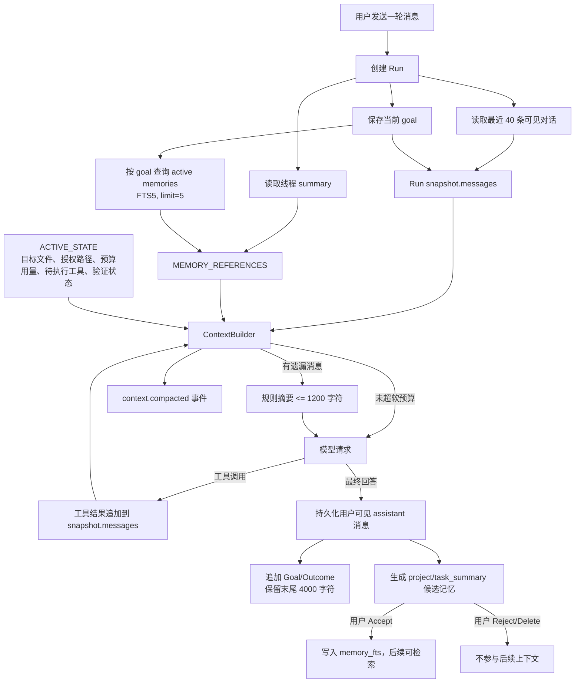

# `code_agent` 上下文压缩与记忆管理策略分析

> 分析日期：2026-07-31  
> 分析对象：`code_agent` 当前工作区中的持久化 Agent Runtime（`/api/agent/*`）  
> 不在范围内：旧 `/api/run` Pipeline、Aider 自身的上下文压缩、NaturalCC RAG 内部的检索算法

## 1. 结论摘要

当前 `code_agent` 已经形成了一个可运行的“持久化原文 + 派生摘要 + 人工治理长期记忆”框架，但整体仍属于 MVP 级策略：

- 上下文压缩本质上是**字符级的确定性软裁剪**，不是按模型 token 计算，也不是由模型生成的语义摘要。
- 跨 Run 上下文由“最近 40 条可见对话 + 最长 4000 字符的线程滚动摘要”组成；单个 Run 内再以默认 40000 字符预算选择消息组。
- 被裁掉的 Run 内消息会被规则化为最多 1200 字符的 `[HISTORY_SUMMARY]`；原文仍保留在会话消息、Run 快照或事件等权威存储中，不会因压缩而删除。
- 长期记忆采用 `candidate → active/rejected/...` 生命周期。Run 成功结束后只会自动生成候选，必须由用户激活后才进入 FTS5 检索和后续提示词。
- 记忆检索是**关键词检索**，不是向量或语义检索；查询仅使用当前 Run 的 `goal`，默认最多返回 5 条。
- 设计方向正确：原始对话保持权威、摘要明确标记为派生信息、长期记忆默认不自动生效、记忆作为不可信数据注入。
- 主要短板是：字符预算不是硬上限、消息选择可能产生不连续上下文、线程摘要可能从条目中间截断、版本失效链路未接入生产流程、候选记忆容易累积、检索召回和可观测性较弱。

一句话定性：**当前实现是“规则型软压缩 + 人工确认的词法长期记忆”，具备安全治理骨架，但尚未达到对长会话和大规模项目稳定可控的生产级上下文管理。**

## 2. 总体数据流



这里存在四种容易混淆的“记忆”：

| 层次 | 存储位置 | 是否进入模型 | 作用 |
|---|---|---:|---|
| 权威可见对话 | `conversation_messages` | 最近 40 条进入新 Run | 保留用户与最终回答原文 |
| Run 执行态 | `events` + `snapshots` | 当前 Run 的 `snapshot.messages` 进入 | 恢复工具调用、审批、验证和运行状态 |
| 线程摘要 | `threads.summary` | 非空时总是作为 thread memory 注入 | 跨 Run 保留更早的 Goal/Outcome 尾部 |
| 治理型长期记忆 | `memories` + `memory_fts` | 仅激活且检索命中的记录进入 | 跨线程/项目复用事实、约束或任务结果 |

## 3. 上下文压缩策略

### 3.1 新 Run 的上下文初始化

创建新 Run 时，运行引擎先读取该线程最近 40 条 `conversation_messages`，随后才把本轮用户消息写入数据库，因此不会把当前用户消息重复读入。Run 快照中的初始 `messages` 为：

1. 最近 40 条历史 `user`/`assistant` 可见消息；
2. 当前用户 `goal`。

对应实现见 [`run_engine.py`](./agent_core/run_engine.py#L88-L177)。

需要注意：跨 Run 继承的是用户可见消息，不包含旧 Run 的内部工具调用和工具输出；这些细节仍存在旧 Run 的事件和快照中，但不会直接灌入新 Run。

### 3.2 线程滚动摘要

每个 Run 产生最终可见回复后，系统将以下条目追加到 `threads.summary`：

```text
Goal: <本轮目标>
Outcome: <最终回答或终止说明>
```

随后通过字符串切片只保留最后 4000 个字符：

```python
summary = f"{previous}\n\n{entry}".strip()[-4_000:]
```

实现见 [`run_engine.py`](./agent_core/run_engine.py#L639-L677)。这不是语义摘要，而是滚动日志尾部，因此有三个直接后果：

- 旧信息按字符被淘汰，而不是按重要性淘汰；
- 切片可能从一个 `Goal/Outcome` 条目中间开始，破坏结构；
- 最近 40 条原文与 summary 中的最近 Goal/Outcome 会重复占用上下文。

终止 Run 也会进入线程摘要，包括 `budget_exhausted`、`failed` 和 `cancelled` 的可见终止说明。这有助于保留失败轨迹，但也可能使低价值的终止记录挤掉更重要的长期约束。

### 3.3 单个 Run 内的字符预算

[`ContextBuilder`](./agent_core/context_builder.py#L7-L111) 默认配置 `max_chars=40_000`。每次模型请求前，它先构造一个不可裁剪的 system 消息，内容包括：

- 策略规则；
- 当前 `USER_GOAL`；
- `ACTIVE_STATE`；
- `MEMORY_REFERENCES`。

可用于历史消息的预算为：

```text
history_budget = max(0, max_chars - len(system_message.content))
```

然后从消息列表末尾反向扫描，优先选择较新的消息组。每组大小使用 `len(json.dumps(group))` 估算，而不是 tokenizer。

### 3.4 工具调用完整性

系统会把一个 assistant 工具调用消息与其后紧邻、且 `tool_call_id` 匹配的工具结果组成 exchange group。选择上下文时按组保留，目标是避免只保留工具调用而丢失结果，或只保留结果而丢失调用。实现见 [`context_builder.py`](./agent_core/context_builder.py#L62-L83)。

这个设计对工具型 Agent 很重要，当前测试也验证了工具交换不会被简单拆开，见 [`test_context_and_memory.py`](./tests/test_context_and_memory.py#L7-L26)。

### 3.5 被省略历史的摘要方式

未被选择的消息不会删除，而是按以下规则生成最多 1200 字符的确定性摘要：

| 消息类型 | 摘要内容 | 单条上限 |
|---|---|---:|
| 普通 user/assistant | `role + 规范化后的 content` | 320 字符 |
| assistant 工具请求 | 工具名称列表，不保留参数 | 未单独限制 |
| tool 结果 | 工具名 + content 前缀 | 160 字符 |
| 总摘要 | 超限后追加 `additional history omitted` | 1200 字符 |

摘要以 `[HISTORY_SUMMARY]` system 消息插入，并声明它是派生信息、权威事件仍已持久化。实现见 [`context_builder.py`](./agent_core/context_builder.py#L47-L59) 和 [`context_builder.py`](./agent_core/context_builder.py#L92-L111)。

这类摘要稳定、低成本、可复现，但会丢失：工具参数、长错误栈、详细 diff、用户长约束的后半段，以及消息之间更深层的因果关系。

### 3.6 压缩触发与审计

只要构造结果中出现 `[HISTORY_SUMMARY]`，RunEngine 就记录 `context.compacted` 事件，包含：

- `authoritative_message_count`：Run 快照中的原始消息数量；
- `model_message_count`：实际发送给模型的消息数量。

实现见 [`run_engine.py`](./agent_core/run_engine.py#L328-L342)。该事件提供了“发生过压缩”的审计信号，但没有保存被省略的消息范围、摘要文本、预算前后字符/token 数或摘要版本，因此还不足以定位具体的信息丢失。

### 3.7 字符预算与 Run token 预算是两套机制

`RunBudget` 默认限制包括 100 次 LLM 调用、100 次工具调用、120000 输入 token、24000 输出 token和 1800 秒，见 [`contracts.py`](./agent_core/contracts.py#L71-L87)。

这套预算负责终止 Run，不负责让单次请求适配模型上下文窗口：

- `ContextBuilder.max_chars` 是单次提示词的字符级软预算；
- `max_input_tokens` 是整个 Run 的累计实际用量；
- 输入 token 只在模型返回 usage 后累计，因此一次调用可以先越过累计上限，下一步才停止；
- 工具定义 schema 和模型输出预留空间没有计入 `ContextBuilder.max_chars`；
- Gateway 自身只设置了输出 `max_tokens=4096`，见 [`model_gateway.py`](./agent_core/model_gateway.py#L32-L75)。

因此，“Run 未耗尽 token 预算”并不代表“下一次模型请求一定不会超过模型上下文窗口”。

## 4. 记忆管理策略

### 4.1 存储模型

`MemoryStore` 与 EventStore 共用 SQLite 文件，默认是 `outputs/agent_runtime.db`。记忆主表保存：

- 作用域：`run`、`thread`、`project`、`user`；
- 类型 `kind`；
- `project_id`、`thread_id`；
- `subject`、`content`；
- 来源 Run 和来源 revision；
- `confidence`；
- 状态和替代关系；
- 创建/更新时间。

只有 active 记忆会写入 FTS5 虚表。表结构和初始化见 [`memory_store.py`](./agent_core/memory_store.py#L11-L47)。

### 4.2 自动写入策略

Run 成功完成时，系统自动创建一条：

```text
scope      = project
kind       = task_summary
project_id = workspace 的绝对路径
subject    = goal 的前 160 字符
content    = Goal + Outcome
confidence = 0.7
status     = candidate
revision   = None
```

实现见 [`run_engine.py`](./agent_core/run_engine.py#L397-L423)。关键治理原则是：**自动生成不等于自动生效**。新记录是 candidate，不在 FTS 索引中，也不会进入后续模型上下文。

失败、取消和预算耗尽的 Run 不创建长期记忆候选，但其可见终止信息仍可能进入线程 summary。

### 4.3 去重策略

候选创建时只做精确去重：在相同 scope、project、thread 下，如果 `subject` 和 `content` 完全相同，且旧记录仍是 candidate 或 active，则直接返回旧 ID。实现见 [`memory_store.py`](./agent_core/memory_store.py#L49-L107)。

这能避免完全重复写入，但无法合并语义相同、措辞不同的任务结果，也无法识别新结论与旧结论之间的冲突。

### 4.4 生命周期治理

代码定义了以下状态，界面和主要调用路径表现为：

```text
candidate → active
candidate → rejected
active/candidate → superseded
active → expired
任意记录 → deleted
```

实际能力包括：

- `activate`：写入 FTS，开始参与检索；
- `reject`：从 FTS 移除；
- `update`：编辑 subject/content/confidence，active 记录会重建索引；
- `supersede`：激活新记录并将旧记录标为 superseded；
- `mark_stale_for_revision`：当项目 revision 变化时将旧 active 记录标为 expired；
- `delete`：删除主表和 FTS 记录。

实现见 [`memory_store.py`](./agent_core/memory_store.py#L109-L220)。Web UI 当前主要提供候选的 Accept、Reject 和 Delete，见 [`App.jsx`](./webui/src/App.jsx#L1718-L1735)。API 另提供创建和更新接口，见 [`agent_routes.py`](./api/agent_routes.py#L404-L453)。

### 4.5 检索策略

每次模型调用前，RunEngine 用**当前 Run 的完整 goal**作为查询：

```python
memory_store.search(
    state["goal"],
    project_id=state["workspace"],
    thread_id=state.get("thread_id"),
)
```

搜索流程如下：

1. 按空白切分 query；
2. 每一部分转成 FTS phrase；
3. 使用 `OR` 连接；
4. 只检索 active 状态；
5. 作用域必须是全局 user、当前 project 或当前 thread；
6. 按 BM25、confidence、更新时间排序；
7. 默认返回前 5 条。

实现见 [`memory_store.py`](./agent_core/memory_store.py#L172-L201)。这能支持明确关键词匹配，但没有 embedding、同义词扩展、rerank 或任务结构过滤。中文原词匹配可以工作，但同义改写、术语变化和只有隐含语义相关的记忆召回不稳定。

`run` 是合法写入 scope，但当前检索条件不包含 run scope，因此这类记录实际上不会通过 `search()` 注入模型。

### 4.6 记忆注入与信任边界

线程 summary 和命中的 active memory 统一放进 system 消息的 `[MEMORY_REFERENCES]` 区域，每条长期记忆格式为：

```xml
<memory id="..." scope="..." untrusted="true">...</memory>
```

同时 system rule 明确要求把 workspace 文件、工具输出和 memory 当作不可信数据，见 [`run_engine.py`](./agent_core/run_engine.py#L305-L326) 与 [`context_builder.py`](./agent_core/context_builder.py#L85-L90)。FTS 排序会使用 subject、content、confidence 和时间，但最终注入提示词的长期记忆只携带 id、scope 和 content，不包含 subject、confidence、来源 revision 或 rank。

这是正确的安全方向。不过当前 content 没有 XML/结构转义；恶意或偶然出现的 `</memory>` 等文本可以破坏逻辑边界。`untrusted="true"` 只是给模型的语义提示，不是强制隔离机制。

### 4.7 版本失效机制的真实状态

`mark_stale_for_revision()` 已实现并有单元测试，但当前生产代码没有调用它；自动创建的 `task_summary` 又固定使用 `source_revision=None`。因此现状是：

- revision 失效能力存在于存储层；
- 默认运行链路不会采集 Git revision；
- 默认运行链路不会在 revision 变化时使旧记忆过期。

换言之，版本失效目前是**已实现但未接线**的能力，不能视为生产中已生效。

### 4.8 删除与保留语义

删除线程会事务性清理该线程的消息、Run、事件、快照、审批和 workspace lease；项目级长期记忆由独立界面治理，不随线程删除。这符合“项目知识不属于单个会话”的设计，但会留下两个治理问题：

- `source_run_id` 可能指向已删除的 Run，来源追溯变成悬空引用；
- 如果记忆内容本身不再正确，用户必须单独删除、拒绝或更新。

## 5. 当前策略的优点

1. **权威数据与派生数据分离。** 压缩不会删除原始事件，线程摘要也被明确标记为派生上下文。
2. **工具交换按组保留。** 避免常见的 tool call/result 协议断裂。
3. **主动状态优先。** 目标文件、授权路径、待审批调用和验证要求位于不可裁剪的 system 区域。
4. **长期记忆默认不自动污染上下文。** 候选必须人工激活，适合代码修改这种高风险场景。
5. **作用域隔离明确。** project、thread、user 的查询条件清楚，并有 thread 隔离测试。
6. **基本来源字段齐全。** 已预留 source Run、revision、confidence 和 supersedes 关系。
7. **可审计、可恢复。** SQLite 中同时存在追加事件和最新版快照，压缩只是模型视图，不影响恢复事实。
8. **敏感信息有前置脱敏。** 用户 goal、模型消息和工具结果在持久化前经过规则脱敏，降低记忆候选带入凭据的风险。

## 6. 主要问题与风险

| 优先级 | 问题 | 证据/原因 | 可能影响 |
|---|---|---|---|
| P0 | `max_chars` 不是硬上限 | 最新消息组即使超预算也会被保留；system 和后插入的 history summary 也可使总量超限 | 大工具输出或长目标可能直接触发模型上下文超限 |
| P0 | 选择结果可能不连续 | 反向扫描会跳过过大的近邻消息，却继续选择更早的小消息 | 出现“保留 assistant、丢失其 user 前提”的语义断层 |
| P1 | 字符预算与 token/模型窗口脱节 | 未使用 tokenizer，未计算工具 schema 和输出预留 | 不同语言、模型和工具数量下行为不可预测 |
| P1 | 线程摘要是尾部截断，不是结构化摘要 | `[-4000:]` 可切断 Goal/Outcome，且与最近 40 条原文重复 | 长会话中关键约束丢失或重复消耗上下文 |
| P1 | 长期记忆版本失效未接线 | 自动候选 `source_revision=None`，生产路径不调用 stale 标记 | 代码演进后仍召回过期结论 |
| P1 | 候选记忆容易膨胀 | 每次成功 Run 都生成完整 Goal/Outcome，只有精确去重 | 审批负担增长，近似重复和冲突难管理 |
| P1 | 记忆结构边界未转义 | content 直接嵌入 XML-like 标签 | prompt injection 或格式破坏风险 |
| P2 | 检索只使用当前 goal 的词法匹配 | 无最近消息、目标文件、实体、embedding 或 rerank | 同义改写、间接相关知识召回不足 |
| P2 | 压缩事件信息不足 | 只记录两个 message count | 难以复盘究竟丢了什么、为何丢失 |
| P2 | 摘要丢失工具参数和细节 | 工具请求只保留名称，工具结果只保留 160 字符 | 复杂修复中可能重复尝试或遗漏失败根因 |
| P2 | thread summary 并发更新冲突被静默忽略 | `VersionConflict` 被捕获后直接返回 | 并发 Run/设置更新时某轮摘要可能缺失 |
| P3 | project_id 使用绝对 workspace 路径 | 仓库移动、复制或路径表示变化会形成新 project identity | 同一项目记忆无法自然迁移 |
| P3 | lifecycle 状态转换较宽松 | activate 可重新激活 rejected/expired 等状态，API 未暴露 supersede/stale | 审计语义依赖调用方自律 |

### 6.1 已实测的两个压缩边界

本次使用当前 `ContextBuilder` 做了只读验证：

- 配置 `max_chars=220`，输入一个 1000 字符的最新 user 消息时，该消息仍被完整保留；构造结果明显超过配置值。
- 配置 `max_chars=500`，历史依次为“大 user → 小 assistant → 大 user → 最新小 assistant”时，两个大 user 被摘要，而两个小 assistant 被直接保留，形成非连续上下文。

这说明 `max_chars` 当前应理解为“历史选择目标值”，不能理解为最终请求硬上限。

## 7. 本地运行库快照

以下只反映 2026-07-31 分析时当前 `outputs/agent_runtime.db` 的元数据，后续运行会改变这些数字：

| 实体 | 数量 |
|---|---:|
| threads | 1 |
| conversation_messages | 4 |
| runs | 2 |
| events | 17 |
| snapshots | 2 |
| memories | 18 |
| active memories / FTS rows | 1 |
| candidate memories | 17 |
| `context.compacted` events | 0 |

唯一线程的 summary 已达到 4000 字符上限。该快照说明长期记忆的人工治理确实在起作用：多数候选尚未进入 FTS；同时也显示候选积压和滚动摘要触顶已是当前实例中的现实状态，而不只是理论问题。

## 8. 建议的改造顺序

### 阶段一：先把上下文上限做成可证明的硬约束

1. 引入与实际模型匹配的 token 估算接口；如果模型 tokenizer 不可用，提供保守回退系数。
2. 总预算同时计算 system、memory、历史消息、工具 schema 和输出预留。
3. 固定保留 system、当前 goal、最新 user 消息、pending tool exchange 和 verification state。
4. 历史消息只保留**连续的最近前缀/后缀区间**，不再跳过大消息后回捞更早的小消息。
5. 超大的单条消息或工具结果先做字段级裁剪/artifact 化，不能依赖“至少保留一组”绕过预算。
6. 在模型请求前执行最终 token 校验；超限时再次压缩或给出可诊断错误。

建议不变量：

```text
input_tokens(messages + tools) + reserved_output_tokens <= model_context_window
```

### 阶段二：把线程摘要改成结构化 checkpoint

用结构化字段代替纯字符串尾部：

```yaml
goals:
  - 当前尚未完成的目标
constraints:
  - 必须保持的接口/兼容性约束
decisions:
  - 已确认的技术选择及理由
failures:
  - 已验证失败的方法与证据
artifacts:
  - 关键文件、测试和 Run ID
covered_message_sequence: [1, 86]
summary_version: 2
```

可先使用确定性提取器，后续再把 LLM 摘要作为可插拔实现。每次更新应按完整条目淘汰，不能从字符串中间切断；最近消息只保留 checkpoint 覆盖范围之后的部分，从源头消除重复。

### 阶段三：完善长期记忆质量和时效性

1. 只提取“稳定事实、明确约束、用户偏好、架构决策、可复用排障结论”，不要默认保存完整最终回答。
2. 候选采用结构化 schema，并保留证据 message/event/run 引用。
3. 自动采集 Git revision；项目 revision 变化时调用 `mark_stale_for_revision()`。
4. 增加近似去重、冲突检测和显式 supersede UI。
5. 检索 query 组合当前 goal、最近用户消息、target files 和结构化实体。
6. 采用 BM25 + embedding + 轻量 rerank 的混合检索，同时为 memory 单独设置 token 预算。
7. project identity 优先使用仓库稳定 ID（例如 remote + repo root hash），绝对路径作为位置属性而不是唯一身份。

### 阶段四：加固安全边界和可观测性

1. 将记忆作为 JSON data block 序列化，或至少对 XML 特殊字符转义。
2. 每条记忆记录 `retrieved_for_run_id`、rank、命中词和最终是否注入。
3. `context.compacted` 事件记录：原始 token、最终 token、被覆盖消息范围、摘要 hash、策略版本和压缩原因。
4. UI 展示“本轮使用了哪些摘要/记忆”，允许用户逐条禁用。
5. 对线程 summary 更新冲突进行重试合并，而不是静默丢弃。

## 9. 建议验收标准

### 上下文压缩

- 任意单条超长 user/tool 消息下，最终请求仍严格小于模型上下文窗口。
- assistant tool call 与对应 tool result 永远成组出现；pending call 明确保留在 active state。
- 不允许出现因跳跃选择导致的孤立普通 assistant 消息。
- 压缩后仍能恢复最新用户目标、未完成计划、最近失败测试、修改文件和审批状态。
- 同一输入和策略版本得到确定性相同的压缩结果。
- 审计事件可以定位被摘要覆盖的 message/event 范围。

### 记忆管理

- candidate 未激活前绝不进入 prompt；active/rejected/expired/superseded 行为均有集成测试。
- 同项目同线程可召回，跨线程 thread memory 不可召回，跨项目 project memory 不可召回。
- revision 变化后，旧 active project memory 自动 expired，不再召回。
- 同义改写查询能召回关键约束，冲突记忆能提示用户选择或生成 supersede 候选。
- 注入内容无法通过闭合标签改变 system 数据结构。
- 删除来源线程后，项目记忆仍可治理，并明确显示“来源 Run 已删除”。

## 10. 最终评价

当前代码已经抓住了两个关键原则：

1. **压缩只改变模型视图，不销毁权威历史；**
2. **长期记忆必须先成为候选，再由用户治理后生效。**

这两个原则值得保留。下一步不应急于堆叠更复杂的 LLM 摘要或向量数据库，而应优先修复上下文硬上限、连续性和摘要结构，再接通 revision 失效与候选去重。完成这些基础工作后，混合检索和语义摘要才会建立在可审计、可控的底座上。

## 11. 关键代码索引

| 主题 | 文件 |
|---|---|
| 上下文构造与规则摘要 | [`agent_core/context_builder.py`](./agent_core/context_builder.py) |
| Run 初始化、模型循环、线程摘要、候选记忆 | [`agent_core/run_engine.py`](./agent_core/run_engine.py) |
| 对话、事件、快照持久化 | [`agent_core/event_store.py`](./agent_core/event_store.py) |
| 记忆生命周期与 FTS5 检索 | [`agent_core/memory_store.py`](./agent_core/memory_store.py) |
| token/调用次数预算 | [`agent_core/contracts.py`](./agent_core/contracts.py) |
| 模型调用与 usage 统计 | [`agent_core/model_gateway.py`](./agent_core/model_gateway.py) |
| 会话与记忆 API | [`api/agent_routes.py`](./api/agent_routes.py) |
| 上下文和记忆测试 | [`tests/test_context_and_memory.py`](./tests/test_context_and_memory.py) |
| Run 压缩/记忆集成测试 | [`tests/test_run_engine.py`](./tests/test_run_engine.py) |
